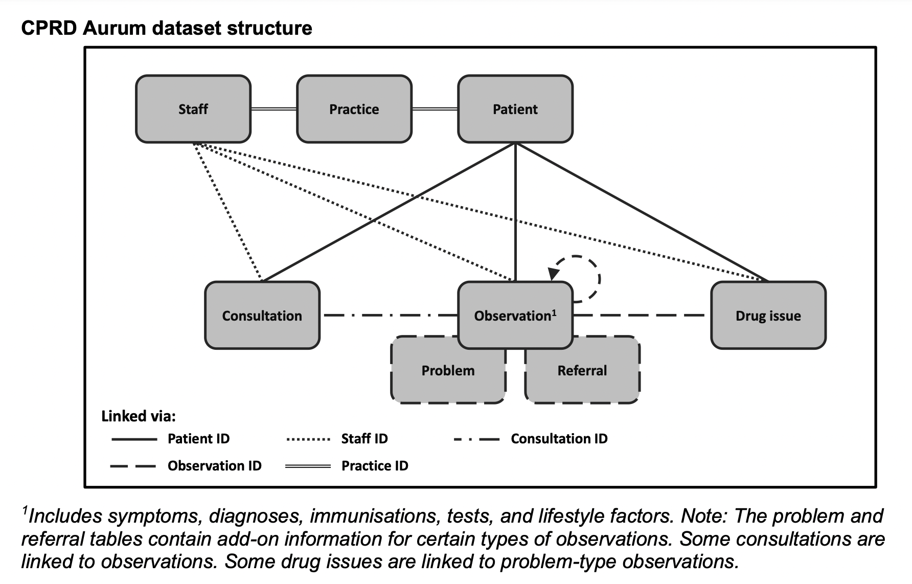

# Overview
This package is for the newer cut of CPRD (Aurum). While the functionality of many elements is consistent with previous pyspark-derived packages for CPRD analyses/processing, this package, generally speaking, serves to connect various data sources that CPRD offers in the following way:

In addition, while no figure is provided, this package serves to link data from Hospital Episode Statistics (HES), Office of National Statistics (ONS) mortality data, and other socio-economic data provided for linkage. 

Lastly, various mappings between disease/drug codes are provided with the package. The user needs to specify source files for mapping, and appropriate mappings will be conducted by functions in the package (e.g., see modalities.py file).
# Structure
As seen in figure above, the patient and practice files are central for a lot of linkage. Practice and patient IDs are the elements that link various sources of data together. The same can be said when extended to HES. Other secondary IDs are indeed used (e.g., observation id) but not extensively. 

## requirements to begin usage
requirements.txt has all the packages required to use and contribute to this repo. Please create a new conda environment (python 3.7) with the function: 
```shell
conda create -n myenv python=3.7
```
Then proceed to navigate to the CPRD folder and install all requirements in the following way:
```shell
pip install -r requirements.txt
```
## config
config includes yaml file which specifies all parameters for genearting data
## CPRD
this folder includes 4 components:  
spark.py set up functions to initialise pyspark, which is then used for data processing.
table.py includes fundamental functions to process each table in CPRD, and utils includes commonly used functions for data processing. functions includes functions for data processing, this is a more specific function folder
## task
task defines the real task
## debug
debug folder has tutorials
